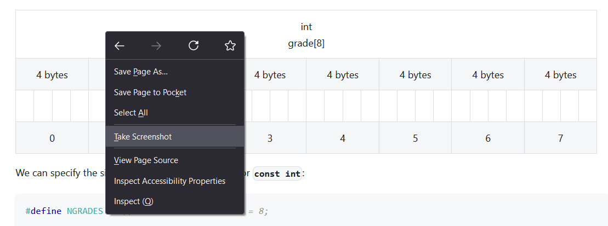
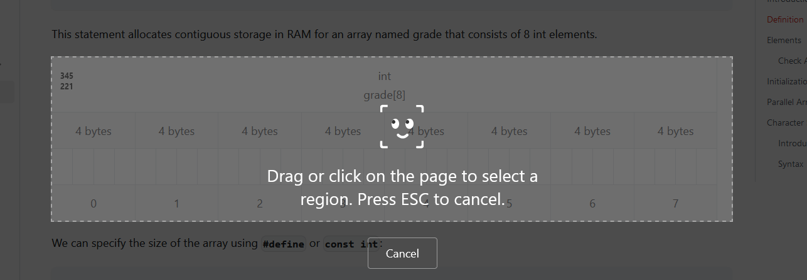
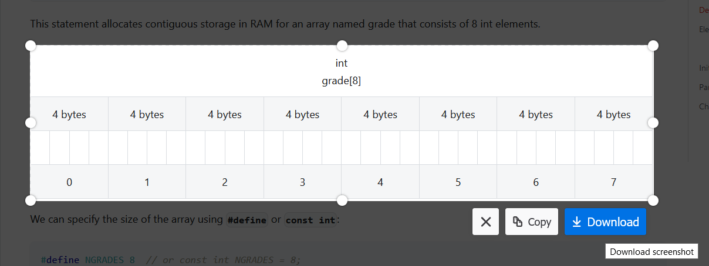

# Contributing

Thanks for your interest in helping us maintain our course notes! We are happy to consider contributions from faculty and students to help make these notes easier to use and improve their correctness.

## Requirements

These notes are built using [Docusaurus](https://docusaurus.io/), a modern static website generator. To use it, you'll need to have the following installed:

- an [LTS version of node.js](https://nodejs.org/en/), which can be checked by running `node -v`. Currently that's node.js 14.x, but confirm with the official site.

- The [yarn](https://classic.yarnpkg.com/en/docs/install#mac-stable) package manager, version >= 1.5 (which can be checked by running `yarn --version`).

- [Visual Studio Code](https://code.visualstudio.com/). This is not strictly necessary, but we encourage it since we use various extensions to make working on the site easier.

## Installation

To install the dependencies, use:

```console
yarn install
```

## Local Development

To develop the site, use:

```console
yarn start
```

This command starts a local development server and opens up a browser window. Most changes are reflected live without having to restart the server.

## Workflows

If you want to make a change, please use the following GitHub workflow:

1. fork this repo on GitHub
1. clone your forked repo to your local machine, `git clone https://github.com/{your username}/IPC144`
1. create a new branch off of the `main` branch, `git checkout -b {new branch name} main`
1. make your changes and save
1. check to see which files have changed, `git status`
1. stage these changed files in git, `git add file1 file2 ...`
1. commit your changes, `git commit -m "Made the following changes..."`
1. push your commits and branch to your fork, `git push origin {new branch name}`
1. [create a Pull Request](https://docs.github.com/en/github/collaborating-with-pull-requests/proposing-changes-to-your-work-with-pull-requests/creating-a-pull-request) on GitHub
1. add a description about what you changed and anything the maintainers need to know

## Standardize frontmatter

Markdown documents can use the Markdown FrontMatter metadata fields, enclosed by a line --- on either side. We use `id`, `title`, `sidebar_position`, and `description`. However, we do NOT use `slug` for it.

## Releases

### Build

To create a production build, use:

```console
yarn build
```

This command generates static content in the `build/` directory and can be served using any static contents hosting service, for example: GitHub Pages.

### Deployment

To build and deploy to GitHub Pages, use:

1. Follow step 1 - 5 in [Docusaurus's Triggering deployment with GitHub Actions](https://docusaurus.io/docs/deployment)

2. Deploy your site to Github Pages, run:

- For Bash:

```console
   GIT_USER=<GITHUB_USERNAME> yarn deploy
```

- For Windows

```console
GIT_USER=<Your GitHub username> USE_SSH=true yarn deploy
```

- For Powershell

```console
cmd /C 'set "GIT_USER=<GITHUB_USERNAME>" && yarn deploy'
```

If you are using GitHub pages for hosting, this command is a convenient way to build the website and push to the `gh-pages` branch.

## Miscellanous

### Tutorial for Converting Table-like Diagrams into Images

To prevent table diagrams overflowing (and having the horizontal scrollbar on narrower viewports),
we use a simple technique to convert them to images. This allows us to have responsive diagrams
with less effort and minimizes HTML syntax on our pages.

Tool Recommendation: Firefox Browser (easier to make screenshots)

1. Run the app (`npm run start`)

2. Go to the browser

3. Go where the table you want to convert is

4. Right click, select "Take Screenshot"



5. Select an area that encloses the whole table



6. Make any adjustments necessary when cropping (avoid having unnecessary space)

7. Click Download



8. Save image to the `/static/img` folder in the IPC144 repo

9. This is how it should end up looking like:


10. Use markdown to place the image wherever you need:

```

```
